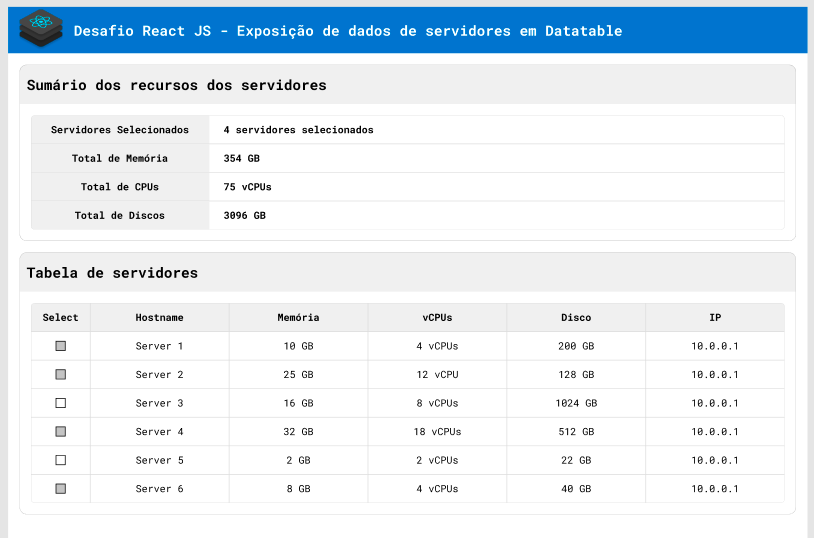

  

 

# Desafio Reactjs 

> Gerenciador de servidores | Desenvolvimento do *desafio reactjs*, Utilizando React.Js 

## 💻 Projeto

O Desafio consiste em consumir uma fake api que trás uma lista de servidores e informações como: tamanho da memória, tamanho da cpu, total de disco etc. 
O sistema além de mostrar todos os servidores com suas informações, é possível somar a quantidade de memória, total de disco e cpu entre eles.
O projeto foi desenvolvido em alta fidelidade do seu protótipo.

## 🔖 Layout

Você pode visualizar o layout do projeto através [desse link](https://www.figma.com/file/7L2KSUYZZGuKmLvLNAaTMh/Desafio-React-JS?node-id=0%3A1). 

---

### 📄 O que foi usado:

- ReactJS
- useState
- useCallback
- useEffect
- Context API
- Css
- Axios

### 🛠 Mão na massa:

> Você pode realizar o clone deste repositório!

Clone o repositório:

`
git clone https://github.com/Lucaslimasz/desafio-reactjs-ibmbrasil.git
`

### 💻 Executando o projeto 🚀

#### Na raiz do projeto, execute os comandos:

# Para instalar as dependências
yarn ou npm install

# Para startar o projeto utilize
yarn start ou npm start

# Para startar a fake api na porta 3333
yarn server ou npm server
`
